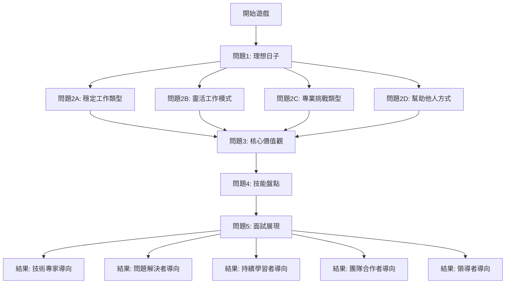
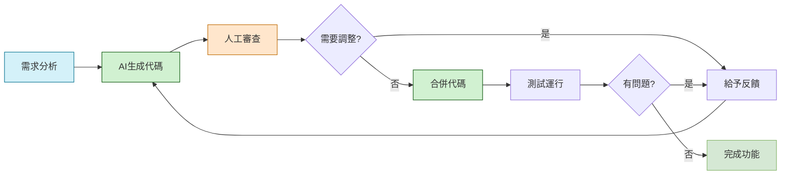

# 🎮 職業生涯導向小遊戲 🎯

<div align="center">


</div>

<p align="center">
  
</p>

<p align="center">
  這是一個互動式職業生涯導向遊戲，幫助用戶通過回答一系列問題來探索適合自己的職業方向。
</p>

---

## 📋 目錄

- [專案介紹](#-專案介紹)
- [特色功能](#-特色功能)
- [技術棧](#-技術棧)
- [開始使用](#-開始使用)
- [遊戲流程](#-遊戲流程)
- [結果類型](#-結果類型)
- [使用Cursor生成專案的過程](#-使用cursor生成專案的過程)
- [貢獻指南](#-貢獻指南)

## 🚀 專案介紹

在當今快速變化的就業市場中，很多人對自己的職業方向感到迷茫。這個小遊戲通過提問的方式，根據用戶的偏好、價值觀和技能，推薦最適合的職業發展路徑和面試準備策略。

## ✨ 特色功能

- 🔄 互動式問答界面
- 🌳 根據用戶回答動態調整後續問題
- 💼 提供詳細的職業方向建議
- 📝 包含面試策略和履歷重點提示
- 📱 響應式設計，適合各種設備使用

## 💻 技術棧

- **前端框架**: React 19.1.0
- **語言**: TypeScript 4.9.5
- **樣式**: CSS3, Inline Styles
- **環境**: Node.js
- **開發工具**: Cursor AI

## 🔧 開始使用

### 安裝

1. 克隆此存儲庫
   ```bash
   git clone https://github.com/MaiAgent-steven/career-path-game.git
   ```

2. 安裝依賴
   ```bash
   cd career-path-game
   npm install
   ```

3. 啟動開發伺服器
   ```bash
   npm start
   ```

4. 在瀏覽器中打開 [http://localhost:3000](http://localhost:3000) 查看應用

## 🎲 遊戲流程

<div align="center">



</div>

1. 📋 用戶回答關於工作偏好的問題
2. 🔄 根據回答引導至下一個更具體的問題
3. 🏁 完成所有問題後，給出職業導向建議
4. 🎯 提供面試準備和履歷優化的具體建議

## 📊 結果類型

<div align="center">

| 導向類型 | 適合人群 | 主要特點 |
|:-------:|:-------:|:-------:|
| **🧠 技術專家導向** | 適合深入技術領域發展的人 | 鑽研專業知識，成為特定領域專家 |
| **🔍 問題解決者導向** | 適合處理複雜問題和系統優化的人 | 面對挑戰，尋找創新解決方案 |
| **📚 持續學習者導向** | 適合快速學習和適應新技術的人 | 樂於探索新知識，吸收新技術 |
| **👥 團隊合作者導向** | 適合團隊協作和溝通的人 | 出色的溝通能力，促進團隊合作 |
| **👑 領導者導向** | 適合帶領團隊和項目管理的人 | 具備願景和執行力，善於激勵他人 |

</div>

每種導向都會提供：
- ✅ 適合的職位建議
- 🏢 推薦的產業領域
- 🎤 面試技巧和準備方法
- 📄 履歷撰寫重點

## 🤖 使用Cursor生成專案的過程

本專案是使用Cursor AI輔助開發工具創建的，以下是開發過程的概述：

### 🧩 初始設計與規劃
1. 使用Cursor與Claude 3.7 Sonnet進行專案需求的對話
2. 通過AI幫助制定遊戲流程和問題結構
3. 設計數據模型和組件結構

### 🛠️ 開發過程與Cursor指令

整個開發過程中，通過向Cursor AI輸入自然語言指令完成各項開發任務。以下是部分關鍵指令與操作的對照：

<div align="center" style="overflow-x: auto;">

#### 1. 初始化專案

| 👨‍💻 用戶輸入 | 🤖 Cursor 操作 |
|:-------:|:-------:|
| ```我想用React製作一個小遊戲，透過字卡選項來幫助學生在求職之前釐清想要做什麼樣的工作。第一個問題會是[你希望你的出社會，試過什麼樣的日子？]``` | - 使用 create-react-app 初始化 TypeScript React 專案<br>- 創建基本目錄結構<br>- 設置初始 App.tsx 和相關組件 |

#### 2. 創建數據結構

| 👨‍💻 用戶輸入 | 🤖 Cursor 操作 |
|:-------:|:-------:|
| 無需明確指令，Cursor 自動理解需要創建數據結構 | - 創建 `career-path-game/src/data/questions.ts`<br>- 設計 Question 和 Option 介面<br>- 實現問題和選項的數據結構<br>- 創建初始問題集 |

#### 3. 設計UI組件

| 👨‍💻 用戶輸入 | 🤖 Cursor 操作 |
|:-------:|:-------:|
| 無需明確指令，Cursor 自動理解需要創建組件 | - 創建 `Card.tsx`：實現選項卡片組件<br>- 創建 `Question.tsx`：實現問題顯示組件<br>- 創建 `Result.tsx`：實現結果頁面組件<br>- 創建 `CareerGame.tsx`：實現遊戲主邏輯組件 |

#### 4. 修改職業建議內容

| 👨‍💻 用戶輸入 | 🤖 Cursor 操作 |
|:-------:|:-------:|
| ```職業方向建議全部換成跟資訊、IT、軟體相關的內容``` | - 修改 `questions.ts` 中所有職業建議<br>- 將各種職業方向更新為IT相關職位<br>- 保持原有問題結構和邏輯流程不變 |

#### 5. 基於面試介紹擴展功能

| 👨‍💻 用戶輸入 | 🤖 Cursor 操作 |
|:-------:|:-------:|
| ```這是我的介紹內容，<br>(二) 自我定位與目標設定：從「理想的日子」出發 (約 20-25 分鐘)<br><br>核心引導問題：「你希望你的出社會，試過什麼樣的日子？」...``` | - 重構 `questions.ts` 添加更多問題層級<br>- 新增「核心價值」、「技能盤點」和「面試表現」問題<br>- 設計結構化結果頁面內容<br>- 根據面試準備方法論擴展問題流程 |

#### 6. 優化界面與用戶體驗

| 👨‍💻 用戶輸入 | 🤖 Cursor 操作 |
|:-------:|:-------:|
| 無需明確指令，Cursor 自動辨識需要更新結果頁面 | - 重新設計 `Result.tsx` 組件<br>- 實現結構化內容顯示<br>- 添加樣式和互動效果<br>- 優化顯示邏輯處理結果格式 |

#### 7. 添加進度指示器

| 👨‍💻 用戶輸入 | 🤖 Cursor 操作 |
|:-------:|:-------:|
| 無需明確指令，Cursor 在擴展功能時自動添加 | - 更新 `CareerGame.tsx` 組件<br>- 添加進度狀態追踪<br>- 實現視覺化進度條組件<br>- 根據問題 ID 更新進度指示 |

</div>

### 🔄 AI輔助改進流程

<div align="center">



</div>

1. 🔄 通過多輪對話優化UI設計和用戶體驗
2. 📋 根據需求動態調整問題結構和內容
3. 📊 改進結果頁面的資訊展示方式
4. 📈 添加進度顯示功能增強用戶體驗

### 🌟 成果與優勢

<div align="center">

| 優勢 | 描述 |
|:-------:|:-------:|
| **⚡ 高效開發** | 使用Cursor大幅加快開發速度，從構思到完成僅需幾小時 |
| **📐 代碼質量** | AI生成的代碼結構清晰，易於維護 |
| **🔄 迭代速度** | 快速實現需求變更和功能擴充 |
| **📏 一致性** | 保持了設計和代碼風格的一致性 |

</div>

這種AI輔助開發方式展示了如何在現代軟體開發中利用先進工具提高效率和質量。整個過程中只需輸入少量自然語言指令，Cursor就能完成大量程式碼編寫工作，大大降低了開發門檻，同時保證了專業水準的代碼質量。

## 🤝 貢獻指南

歡迎提交問題報告和拉取請求。對於重大更改，請先開啟一個問題討論您想要更改的內容。

---

<div align="center">
  <sub>用 ❤️ 和 Cursor AI 共同創建</sub>
</div>

